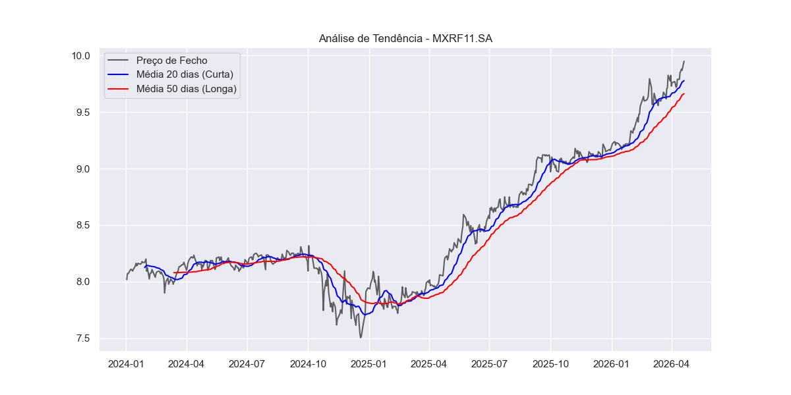

# analise-financeira-python
# Análise de Ativos Financeiros com Python 📈

Este projeto utiliza Python e bibliotecas de Ciência de Dados para realizar análises técnicas básicas em ativos da bolsa brasileira (B3). O foco inicial é a análise de tendências através de Médias Móveis Simples (SMA).

## 🚀 Tecnologias Utilizadas
- **Python 3.x**
- **Pandas**: Manipulação e tratamento de séries temporais.
- **YFinance**: Coleta de dados reais do Yahoo Finance.
- **Matplotlib & Seaborn**: Visualização de dados e geração de gráficos estatísticos.

## 📊 Funcionalidades
- Download automático de dados históricos de fechamento.
- Cálculo de Médias Móveis de 20 e 50 dias.
- Geração de gráfico comparativo para identificação de suporte, resistência e cruzamentos de tendência.
- Exportação automática do gráfico em formato `.png`.

## 📈 Visualização do Resultado
Abaixo, o gráfico gerado automaticamente pelo script para o fundo imobiliário **MXRF11**:

---
*Projeto de autoria de Samuel Vaz Caixeta, desenvolvido como parte dos meus estudos de Python aplicado à Inteligência Artificial e Ciência de Dados.*